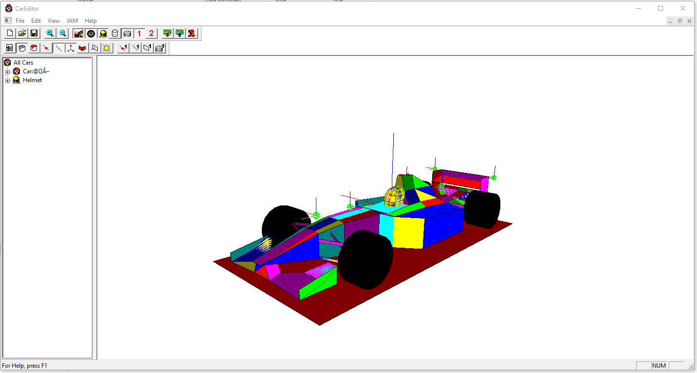

# gp2careditor
F1GP2 Car Editor

Over 20 years ago I worked on tools to help the GP2 modding community, having thought I had lost all the source I recently rediscovered it.

I'm uploading for anyone still using this tools to enjoy and build (currently builds with Visual Studio 2017 x86 and x64)

## Documentation

Have a look at the [original tutorial from 1996](docs/GP2%20Car%20Shape%20Tutorial.md) of the GP2 car shape format, its binary and texture mapping.
