# Car Shape Tutorial

## Car Shape Primer

**by Paul Hoad**

- Version 3: Cleanup by [Daniel Senff](https://www.danielsenff.de), Glossary
- Version 2: Added info on changing points and verticies
- Version 1: Basic beginnings

> [!NOTE]
> This tutorial from 1998 uses a different terminology to what has become common terms in 3D modelling.  
>    GP2/GP2careditor: Points -> Verticies  
>    GP2/GP2careditor: Verticies -> Edges  
>    GP2/GP2careditor: Texture -> Face  


## Introduction

Before running car shape editor be sure to backup `gp2.exe`!

The purpose of this introduction is to start people off in car shape editing using my car shape editor.  
When you first run the car shape editor you are presented with the following screen.

[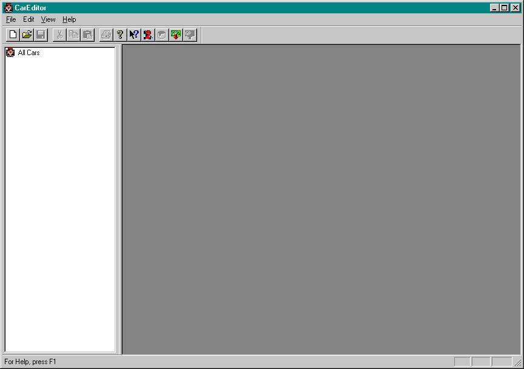](images/main.gif)

Before you can use the editor you must tell it where to locate your `gp2.exe` to do this select Edit->Edit GP2 location now use the browse window to point it at the GP2 directory in which it can fine the `gp2.exe`.

Now you are ready to import your car from `gp2.exe` first select File->Import From Exe or use the toolbar icon.


when you do this a window will appear with your car in it!

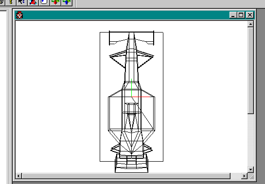  

Use the mouse and control keys to rotate the car round to a suitable angle!

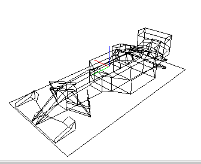

Now you might like to select fill object (paint can) from the toolbar to make it easier to see!

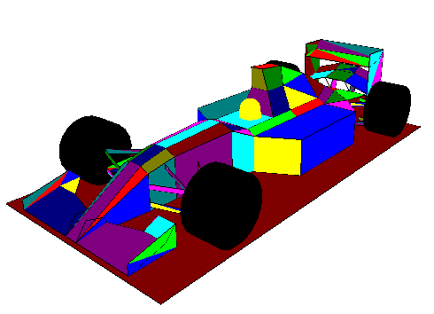  

Now your ready to edit your carl

Firstly open the tree

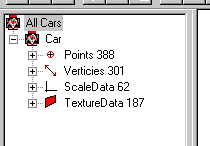  

Up to version 0.3 you can still only edit one part of the car and that is the scaleData but there is alot of scope here for different car shapes and while you lot play with that I'll work on getting the rest editable!

Firstly you should know something there is actually two different cars! I found editing the scale data 0-31 affect car 1 and 32-62 effect car 2

- Benetton, Arrows, Pacific are car 1 (high nose)
- Ferrari, Williams and the others are car 2 (low nose)

So open up the scale data

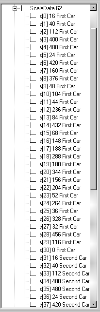  

You can see here that the data from s\[31\] meaning scale value 31 onwards look very similar to the first car!

Ok. so let make a change to the data

Double click on s\[0\] 16 you'll get a data entry box like this up!

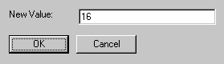

Enter a new value in here 70 will do!

Now look at the car

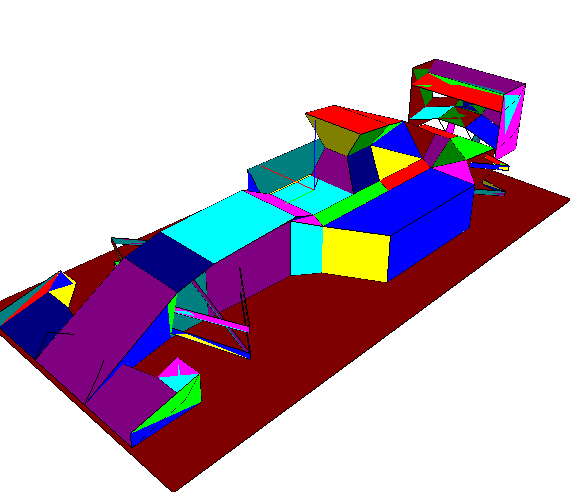

See that! it changes a number of the polygons to be alot wider! its hard for me to explain what is going on here but lets just say that all the dimensions of the car are encoded into 32 numbers allowing for a symmetrical design to be made in the minimal amount of disk space, hopefully in time this may change and we will be able to add more polygons and more data points but for now this is a long way off!

Oh! yes now you want to Export it to your exe, be sure you have a backup now go for a quickrace and you'll need to use the cameras to see your changes. You notice the other cars still look normal from inside the cars well this is becuase of the rcr.jam files hopefully in time we will get this. but for now just make some new cars. Cars can be saved out to disk aswell so you can experiment.  

So which Scale values do what!

s\[0\] is the width of the central portion of the car  
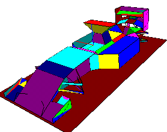  
s\[1\] width of mid front pod plus depth of air intake  
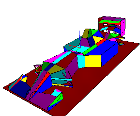  
s\[2\] air intake pod depth  
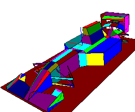

s\[3\] wing depth  
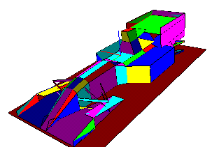  
s\[5\] is width of middle of air intake pod  
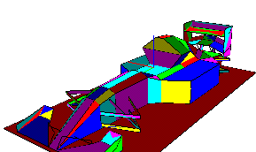  
s\[7\] is the side pod width (man alive!)  
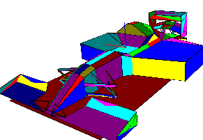

Ok, so now we want to change someting more than the scale value I want to change some of the vertex information and some of the point information

Vertex basically are pairs of numbers that index the point data

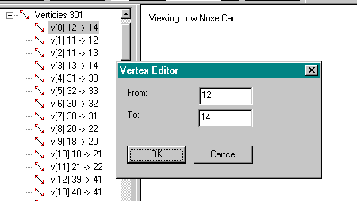

So reading the tree vertex 0 or (v\[0\]) connect point 12 to point 14 using the wireframe view and selecting on a vertex shows the vertexup in red beware that the polygons use index's into the vertex list in a similar way to the way vertex's use the point data so changing one vector could have a major effect on textures and basic car shape!  

Ok, lets move onto something more complicated, I've played with the scale values and now I want something more interesting: how about individual points  

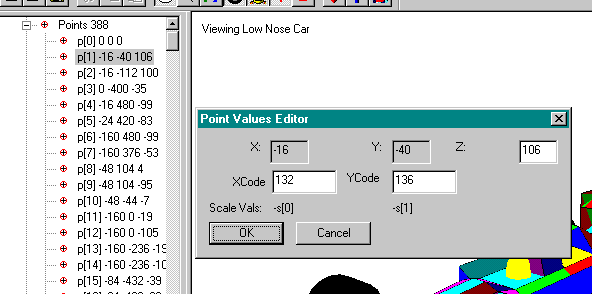  

Well there are a fair few points in the car editor some 388 but beware the first 194 are used for car 1 (low nose cone) and the next 194 are for car 2 (high nose cone) you should also notice that were as changing the scale values usually effects both cars changing the point data only effect one of the two cars

Double click on a point brings up a dialog box like that shown in the image. the actual point data for p\[1\] is (-16,-40,106). If you look at the image while selecting a point you'll see a red cross over the point your trying to edit! So now I want to change the data well nothing is easy in this game and although I hope to improve this interface its abit of hand coding for now!

you'll see fomr the box that the X and Y are not directly editable why? well its becuasec these values have been derived from the scale data the actually code in the model is an X value of 132 (0x84) and Y = 136 (0x88)  
Believe me when I say that these values are associated with an X value equals to s\[0\] (scale value 0) but negative I'll explain how

Firstly this number 132 (0x84) in our case is above 0x80 so its negative (in gp2 terms) so lets take 132 and subtract 0x80 (128 dec)  
This give us 4 (good maths eh!) ok now take this number and subtract 4 
now divide by 4 and the answer you get is the index your using so written down

`X = s[index]`

where

`index = ((XCode-128)-4)/4`

or more simply

`index = (XCode-132)/4`

Do this for 136 and you'll see see what I mean…

`136-132/4 = 1`

now use the fact that number over 0x80 are -ve and the `YCode = -s[1]` looking back at the scaledata  
we see the `s[1] = 40` so the Y value is -40………(ping! get it!)

what about the Z? Well, thank fully the Z can be anything!

**It's not the end of things**

Sometimes the XCode is above 0x8000  ……aarrrggghh! How do I handle this…..  
I'll show you with an example:  

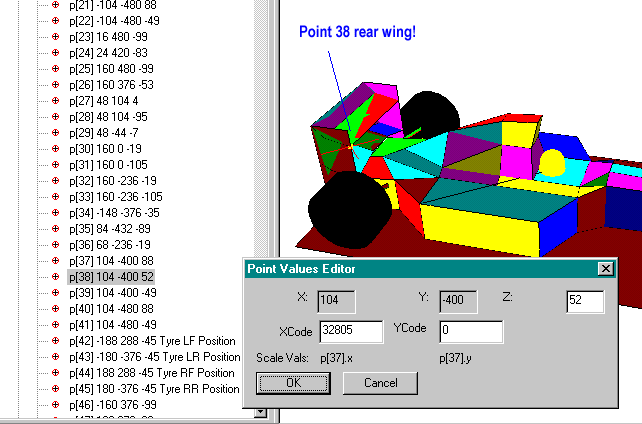

Point 38 is the rear wing and for reason probably of speed for Geoff if he only had to work out one 3D point then he could get away with less calculations and would have to store less data. so if geoff had already calculated am X,Y pair that he wanted to use again instead of putting in the original code he puts in a code that points to the original point these values are signified by values over 32768 (0x8000)  so in point 38 it says use the x and y values from point 37 but use my own Z value (thankfully!)

I'll try in the near future to allow you to do this a bit easier than it is now, but here goes for the time begin…  
so how do I know this mean use the point 37 well I said it is values over `0x8000` well they start at 0x8001 and this mean use the first point in the pointData structure.

so `X =  p[index].x`  & `Y= p[index].y`

where `index = XCode-32768` in our example

`32805 - 32768 = 37`

hence X and Y are use point  p\[37\]

Now most of the time YCode is 0 and I haven't seen a YCode of non zero but then I haven't looked, the car shape editor ignores it but that doesn't mean gp2 does. if anyone has seen a value with something other than 0 in, let me know!  

Ok, this should get you more than some way into the car shape editing problem

I should also warn you of another thing.  
I think that the helmet location is defined by p\[63\] and the tyres by p\[42\], p\[43\], p\[44\], p\[45\]  
of course add 194 to all those values to get the locations in the high nose car!

## Helping out with texture mapping

All, ok! I've hit a bit of a wall with regard to finding the textures mapping from the 2D jam to the 3D polygons, so while I continue to look, I thought you could help me out.

I've put a new version of the car shape editor onto my site

http://www.volftp.tin.it/GP2/trackedit/careditor0.7\_texture.zip

and you'll see that this contains a `texture.cfg` file opening up this file you'll see the following data

```
\-------------------------------------cut---------------  
/ This is the texture configuration file it's format is  
// index,x1,y1,x2,y2,x3,y3,x4,y4  
// it maps the 2D Jam file to the 3D polygons  
// by editing this file you can help me determine  
// the mapping of textures onto polygons to  
// a help the development effort  
// allowing me to concentrate on add additional editing  
// functionality to the Car Shape Editor  

// first 0 and 1 are wheel location definition so they can be ignored

2,188,114,134,114,134,97,188,97

// this will map the whole jam onto polygon 3  
3,0,164,256,164,256,0,0,0  
\-------------------------------------cut---------------
```

Now if you have a texture map capable openGL library if you run this car editor and import your car you'll see that 2 of the polygons are mapped with textures the rest remain yellow!

now by editing the texture.cfg file using a text editor you can fill in the mapping between the jam file and the 3D model. I know this isn't ideal but it should only be 194 polygons that need to be done, and for that we car gonna get the best 3D carset viewer we have had! In the meantime when my machine is fixed I'll add the ability to import the jam files from the game so we can use this as a way of viewing the all the cars! not just the ferrari!

Take a look at the following to get an idea of what is going on

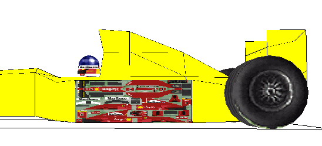

This should me mapping the whole of the jam file (256x164 pixels) onto the side pod! using the following line!

    2,0,164,256,164,256,0,0,0

2 at the front being the index in the tree of the polygon I want to map it to, in this case the side pod!

The following after that are the 2D coordinates on the jam that get mapped to each vertex!

its impotant to note that the polygons have an order in which they are created sometimes clock wise sometimes anti clock wise and this is the order in which you must specify the 2D coordinate so given a square

```
a------b  
|      |  
|      |  
c------d
```

It doesn't follow that we will always want to specify it as (a b c d) in fact if you explode the vertex box in the editor you will see side pod 2 consists of a polygon with verticies -1 -2 3 4 from the tutorial we know that the -ve number mean go the other direction! So we need to select vertex 1 2 3 4 in turn….

Did you see the way round the polygon the highlighted line travelled yes 

`bottom - left - top - right`

Now the polygon is defined by the beginning point of the vertex!

so out 2D order would be `d c a b`

Hence our correct line for polgon 2 is

```
id x1  y1  x2  y2  x3  y3  x4 y4  
2,188,114,134,114,134,97,188,97
```

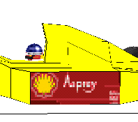

At the moment it only handles polygons of 4 vertices and you'll notice not all polygons seem to have an actual polygon some are commands that say things like put a wheel or a helmet here!

So do you want to help well if you do then do one at a time and then mail it to me I'll try to keep an upto date list and post it to the forum as often as possible also I would be grate full if people would label the polygons they do with comments telling people where this it is on the car!  

Together we should have a very good car!  
I suggest only doing the numbers below 194 to begin with because we could well fine the others are simply a repear! with only a few minor alterations!

[Get the latest cfg file](https://github.com/paulhoad/gp2careditor/blob/master/texture.cfg)

Many thanks

Paul Hoad
